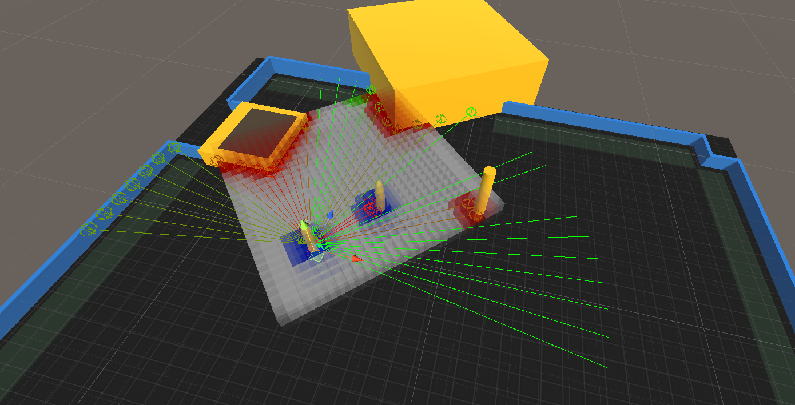

<!-- ABOUT THE PROJECT -->
## About The Project

In this project we try simulate the human behaviour when moving in crowds using Unity and ML-Agents ToolKit. We have used different machine learning approaches, like reinforcement learning, imitation learning and combination of them.
This project is a part of a summer internship at [CYENS - Centre of Excellence](https://www.cyens.org.cy/en-gb/).

## Prerequisites

* ML-Agents Toolkit [Available Here](https://github.com/Unity-Technologies/ml-agents)
  ```sh
  Version 2.0.0 and above
  ```
* Unity
  ```sh
  Version 2019.4.18f1 and above
  ```
  
<!-- USAGE EXAMPLES -->
## Usage

Once you open the project, you can navigate to Assets/Scenes. There you will find the following three folders.


* Visualization
  *  This section contains scenes that simply read the data from .csv files and visualize them.
  *  To run this section, just load and play the "Menu" scene, then select the path containing the the appropriate .csv files and finally click the "Load" button.
  *  When the scene begins, you can click "Simulate" to start the simulation and also, you have the ability to pause the simulation, change the current timestep and the time scale. 
  
* Reinforcement
  *  This section contains the two available scenes "Zara" and "Students" and the movement of the agents using Reinforcement Learning only.
  *  To run this section, just load the desired scene and play it.

* Imitation
  *  This section contains the two available scenes "Zara" and "Students" and the movement of the agents using Imitation Learning (GAIL Algorithm).
  *  To run this section, first load the desired scene. Then, you can select the GameObject named "Plane" and locate to the attached script named "LoadDataLearn". In this script you can adjust two parameters, the "NumOfAgents", which define the number of agents that will be spawned, and the "Neighbour Percentage" (0-100) which defines the possibility of agents to spawn together. 

## Samples
Solarized dark             |  Solarized Ocean
:-------------------------:|:-------------------------:
  |  


